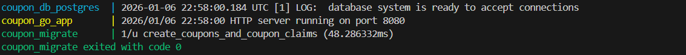

<a name="readme-top"></a>

[](https://github.com/adirhmn/coupon-system/graphs/contributors)
[](https://github.com/adirhmn/coupon-system/network)
[](https://github.com/adirhmn/coupon-system/stargazers)

<br />
<div align="center">
  <h3 align="center">Coupon System</h3>

  <p align="center">
    Coupon System is a REST API built with Go and PostgreSQL to manage coupon creation, claiming, and tracking with strong concurrency guarantees.
    <br />
    The system is designed to handle high-concurrency scenarios such as flash sales and prevent double-claim attacks.
    <br />
    <a href="https://github.com/adirhmn/coupon-system/issues">Report Bug</a>
    ·
    <a href="https://github.com/adirhmn/coupon-system/issues">Request Feature</a>
  </p>
</div>

<!-- TABLE OF CONTENTS -->
<details>
  <summary>Table of Contents</summary>
  <ol>
    <li>
      <a href="#about-the-project">About The Project</a>
      <ul>
        <li><a href="#software-architecture">Software Architecture</a></li>
        <li><a href="#key-features">Key Features</a></li>
        <li><a href="#built-with">Built With</a></li>
      </ul>
    </li>
    <li>
      <a href="#getting-started">Getting Started</a>
      <ul>
        <li><a href="#prerequisites">Prerequisites</a></li>
        <li><a href="#how-to-running-project">How to Running Project</a></li>
      </ul>
    </li>
    <li><a href="#usage">Usage</a></li>
    <ul>
        <li><a href="#api-endpoints"> API Endpoints</a></li>
        <li><a href="#postman-collection">Postman Collection</a></li>
      </ul>
  </ol>
</details>

<!-- ABOUT THE PROJECT -->

## About The Project

**Coupon System** is a backend RESTful service that allows:

- Creating coupons with limited stock
- Claiming coupons safely under high concurrency
- Retrieving coupon details and claim history

The system is intentionally designed to handle **race conditions**, **flash sale traffic**, and **double-claim attempts** using database-level guarantees and atomic transactions.

---

### Software Architecture

The **Coupon System** system is designed with a modular and layered architecture to ensure separation of concerns, maintainability, and scalability. The application follows a typical **MVC (Model-View-Controller)** and **Service-Oriented Architecture** with clear responsibilities for each component.

Architecture Overview

```text
┌────────────────────────────────────────────┐
│            Presentation Layer              │
│        (HTTP Handlers / REST API)          │
└────────────────────────────────────────────┘
                    │
                    ▼
┌────────────────────────────────────────────┐
│                Service Layer               │
│      (Business logic & validation)         │
└────────────────────────────────────────────┘
                    │
                    ▼
┌────────────────────────────────────────────┐
│              Repository Layer              │
│   (DB transactions & concurrency control)  │
└────────────────────────────────────────────┘
                    │
                    ▼
┌────────────────────────────────────────────┐
│                Database Layer              │
│          (PostgreSQL + constraints)        │
└────────────────────────────────────────────┘
```

Key architectural decisions:

- Atomic coupon claiming using database transactions
- Uniqueness enforced via database constraints
- Clear error mapping from repository → service → HTTP layer

### Key Features

1. **Coupon Creation**  
   Create coupons with a fixed stock amount.

2. **Safe Coupon Claiming**

   - Stock will never go below zero
   - Same user cannot claim the same coupon more than once

3. **Concurrency Protection**

   - Database transactions
   - Row-level locking
   - Unique constraints

4. **Coupon Details & Claim History**  
   Retrieve coupon info including remaining amount and claim history.

5. **Deterministic Error Handling**

   | Error                 | HTTP Status |
   | --------------------- | ----------- |
   | Coupon not found      | `404`       |
   | Coupon already exists | `409`       |
   | Already claimed       | `409`       |
   | Out of stock          | `400`       |

6. **Dockerized Setup**
   - PostgreSQL
   - Database migration
   - Go REST API

<p align="right">(<a href="#readme-top">back to top</a>)</p>

### Built With

- [![Go][Go]][Go-url]
- [![PostgreSQL][PostgreSQL]][PostgreSQL-url]
- [![Docker][Docker]][Docker-url]

<p align="right">(<a href="#readme-top">back to top</a>)</p>

<!-- GETTING STARTED -->

## Getting Started

Welcome to "Coupon System" API! This section will guide you through the process of getting started with coupon system services.

Get a local copy up and running follow these simple example steps.

### Prerequisites

1. Git Installation:

Make sure Git is installed on your computer. If not, you can download and install it from [here](https://git-scm.com/).

2. Docker Installation:

Install Docker by following the instructions for your operating system from [here](https://docs.docker.com/desktop/install/windows-install/).

### How To Running Project

#### Clone Repository to Local

1. Copy Repository URL

   On the repository page, look for the `Code` or `Clone` button located at the top right. Click on the button and copy the displayed URL (usually in HTTPS or SSH format).

2. Open Terminal

   Open the terminal or command prompt on your computer.

3. Navigate to Destination Directory

   Use the `cd` command to navigate to the directory where you want to store the project. For example:

   ```bash
   cd path/to/destination/directory
   ```

4. Clone Repository

   Type the following command to clone the repository:

   ```bash
   git clone [Repository URL]
   ```

   Replace `[Repository URL]` with the URL

   ```bash
   git clone https://github.com/adirhmn/coupon-system
   ```

5. Done!

   The project has now been successfully cloned to your computer. You can start working or exploring the code of the project.

#### Running Project with Docker Compose

1. Navigate to Project Directory

   After cloning the repository, navigate to the project directory:

   ```bash
   cd repository-directory
   ```

2. Create an .env file

   You can create it by changing the `.env-example` file to `.env`

3. Start Docker Compose

   Make sure Docker is installed and running on your system.
   Run the following command to start the application using Docker Compose:

   ```bash
   docker-compose up --build
   ```

   This command will build the Docker images and start the containers in detached mode.

   > **Important:**  
   > Make sure the `coupon_migrate` container runs successfully and exits without errors.  
   > This container is responsible for executing database migrations before the application starts.
   >
   > You can verify it by checking the container status:
   >
   > ```bash
   > docker ps -a
   > ```
   >
   > Ensure the `coupon_migrate` container has a status like:
   >
   > ```text
   > Exited (0)
   > ```
   >
   > as shown in the image below.
   > 
   > If the migration container fails, the application may not work correctly due to missing database tables.

   Congratulations your app has been running at `http://localhost:8080` and you can checking status app by access `http://localhost:8080/api/ping` and you will get response

   ```
   {
    "success": true,
    "error": "",
    "data": {
        "server_says": "pong"
      }
   }
   ```

<p align="right">(<a href="#readme-top">back to top</a>)</p>

<!-- USAGE EXAMPLES -->

## Usage

#### API Endpoints

Explore and interact with the Coupon System API using the following endpoints.
| Method | Endpoint | Description |
|-------:|-----------------------|---------------------------------|
| POST | /api/coupons | Create a new coupon |
| POST | /api/coupons/claim | Claim a coupon |
| GET | /api/coupons/{name} | Get coupon details by name |

You can use tools like [Postman](https://www.postman.com/) for a convenient API testing experience.

#### Postman Collection

To simplify API testing, you can use the provided Postman collection.

1. **Download Postman:**
   If you don't have Postman installed, you can download it [here](https://www.postman.com/downloads/).

2. **Import Collection:**
   Download Coupon System API Postman collection [here](https://github.com/adirhmn/coupon-system/blob/main/coupon_system.postman_collection), and import it into Postman.

3. **Set Environment Variables:**

   - Create a new environment in Postman.
   - Set the following variables:
     - `localhost`: `http://localhost:8080/api/`

4. **Explore and Test:**

   - Browse the available requests in the Coupon System API collection.

5. **Execute Requests:**
   - Execute requests to create coupon, claim coupon, and get details.

_For screenshot, please look up to the [Documentation](https://github.com/adirhmn/coupon-system/tree/main/documentation)_

<p align="right">(<a href="#readme-top">back to top</a>)</p>

<!-- MARKDOWN LINKS & IMAGES -->
<!-- https://www.markdownguide.org/basic-syntax/#reference-style-links -->

[PostgreSQL]: https://img.shields.io/badge/PostgreSQL-20232A?style=for-the-badge&logo=postgresql&logoColor=61DAFB
[PostgreSQL-url]: https://www.postgresql.org/
[Go]: https://img.shields.io/badge/Go-4A4A55?style=for-the-badge&logo=go&logoColor=61DAFB
[Go-url]: https://go.dev/
[Docker]: https://img.shields.io/badge/Docker-0769AD?style=for-the-badge&logo=docker&logoColor=white
[Docker-url]: https://www.docker.com/
